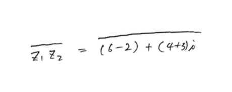

# Results

## Positive Cases

### 1. Fractions & Conjugates
<h4> input_image </h4>

<h4> output image </h4>
<h5> line1 </h5>

<h5> line2 </h5>

<h5> line3 </h5>

### 2. Exponentials & Line intrusions
<h4> input_image </h4>

<h4> output image </h4>
<h5> line1 </h5>

<h5> line2 </h5>

<h5> line3 </h5>

### 3. Tilted Exponentials & Line intrusions
<h4> input_image </h4>

<h4> output image </h4>
<h5> line1 </h5>

<h5> line2 </h5>

<h5> line3 </h5>

### 4. Bound lines
<h4> input_image </h4>

<h4> output image </h4>
<h5> line1 </h5>

<h5> line2 </h5>

<h5> line3 </h5>

<h5> line4 </h5>

<h5> line5 </h5>

### 5. Bound lines with equals (Intruding each other)
<h4> input_image </h4>

<h4> output image </h4>
<h5> line1 </h5>

<h5> line2 </h5>

### 6. Fractions in matrix
<h4> input_image </h4>

<h4> output image </h4>
<h5> line1 </h5>

<h5> line2 </h5>

<h5> line3 </h5>

<h5> line4 </h5>

### 7.exponentials
<h4> input_image </h4>

<h4> output image </h4>
<h5> line1 </h5>

<h5> line2 </h5>

### 8.conjugates
<h4> input_image </h4>

<h4> output image </h4>
<h5> line1 </h5>

<h5> line2 </h5>

